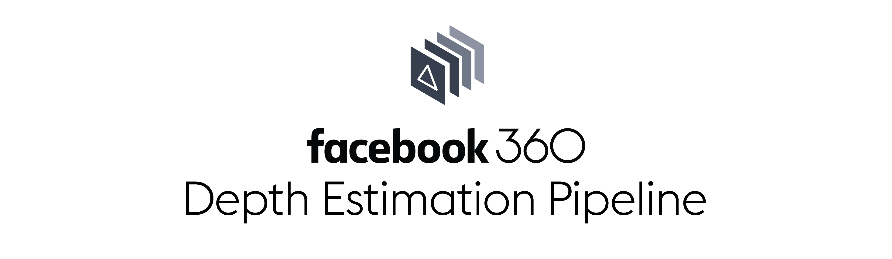

--------------------------------------------------------------------------------

Facebook360 Depth Estimation Pipeline (facebook360_dep) is a computational imaging software pipeline
supporting on-line marker-less calibration, high-quality reconstruction, and real-time streaming
and rendering of 6DoF content.

This work is based on the 2019 SIGGRAPH Asia publication ["An Integrated 6DoF Video Camera and System Design"](https://research.fb.com/publications/an-integrated-6dof-video-camera-and-system-design/).

## Contents

- [Requirements](#-requirements)
- [Documentation](#-documentation)
- [How to Contribute](#-how-to-contribute)
- [Code of Conduct](#code-of-conduct)
- [Support](#-support)
- [License](#-license)

## 📋 Requirements

facebook360_dep can be run on Windows, macOS, or Linux as your development operating system with the use of Docker.
Building source natively on operating systems has been tested on Mac but is *not* the recommended way to use the
software pipeline. Certain capabilities are restricted on the operating systems, due in part to restrictions to the GPU from Docker.

## 📖 Documentation

Here you can find short guides for the most common scenarios: [facebook360_dep][tutorial].

[tutorial]: https://facebook.github.io/facebook360_dep/docs/tutorial.html

## 👏 How to Contribute

The main purpose of this repository is to continue evolving facebook360_dep core. We want to make contributing to this project as easy and transparent as possible, and we are grateful to the community for contributing bugfixes and improvements. Read below to learn how you can take part in improving facebook360_dep.

### [Code of Conduct][code]

Facebook has adopted a Code of Conduct that we expect project participants to adhere to.
Please read the [full text][code] so that you can understand what actions will and will not be tolerated.

[code]: https://code.fb.com/codeofconduct/

### [Contributing Guide](CONTRIBUTING.md)

Read our [**Contributing Guide**](CONTRIBUTING.md) to learn about our development process, how to propose bugfixes and improvements, and how to build and test your changes to facebook360_dep.

### Good First Issues

We have a list of [good first issues][gfi] that contain bugs which have a relatively limited scope. This is a great place to get started, gain experience, and get familiar with our contribution process.

[gfi]: https://github.com/facebook/facebook360_dep/labels/good%20first%20issue

## Support

If you need help with your facebook360_dep app, the right place to go depends on the [type of help that you need][supp].

[supp]: https://github.com/facebook/facebook360_dep/blob/master/.github/SUPPORT.md

## 📄 License

facebook360_dep is BSD licensed, as found in the [LICENSE](LICENSE) file.
